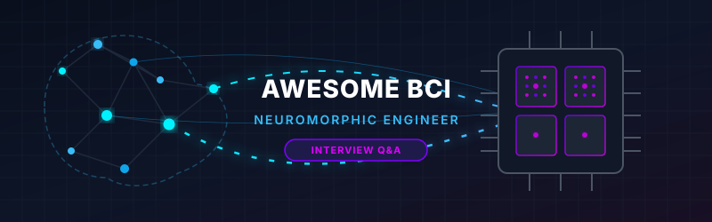

<p align="center">
  
</p>

# 🧠 Awesome BCI Neuromorphic Engineer Interview Q&A ⚡

<p align="center">
  <a href="https://github.com/ishandutta2007/Awesome-Awesome-Awesome"></a>
  <a href="https://discord.gg/jc4xtF58Ve"></a>
  <a href="https://github.com/ishandutta2007"></a>
</p>

> **Keywords:** Brain-Computer Interface, Neuromorphic Computing, Spiking Neural Networks (SNN), Neural Decoding, Silicon Neurons, Event-Driven Processing, Bio-signal Acquisition, Implantable BCI, Wearable BCI, Edge AI.

A comprehensive, community-curated collection of **185+ interview questions and answers** for **Brain-Computer Interface (BCI) Neuromorphic Engineer** roles — professionals who design hardware and software systems at the intersection of brain-computer interfaces and neuromorphic computing, building silicon neural processing architectures that interface with biological neural signals, implementing spike-based neural decoding on energy-efficient neuromorphic chips, and engineering the edge-computing layer that makes implantable and wearable BCIs practical for clinical and consumer deployment.

## 📌 Overview 🔍

**BCI Neuromorphic Engineers** combine deep BCI system engineering (electrode arrays, neural signal acquisition, real-time decoding) with neuromorphic computing hardware expertise (spiking neural networks, event-driven processing, silicon neuron architectures), building the next generation of low-power, high-performance neural interfaces that process brain signals on-chip rather than streaming raw data to external processors — enabling untethered, battery-powered implantable BCIs, wearable neural monitoring, and closed-loop neuromodulation with sub-millisecond latency.

This repository covers:
- 🧠 Neuromorphic computing architectures and spiking neural networks (SNNs)
- 🔌 Neural signal processing on neuromorphic hardware
- 🧬 BCI system architecture — implantable, wearable, and high-density arrays
- ⚡ Spike encoding and neural-to-neuromorphic signal translation
- 🤖 SNN training and deployment for neural decoding tasks
- 🔄 On-chip learning and adaptation for chronic BCI stability
- 🔋 Power, area, and latency co-optimization for implantable constraints
- 🛡️ Safety, biocompatibility, and regulatory engineering for implantable BCIs

**Estimated preparation time:** 30–50 hours
**Interview duration:** Typically 4–6 rounds (3–5 hours), often including a hardware architecture design round, an SNN/algorithm coding round, and a system-level design discussion

---

## 📚 Repository Structure

```
Awesome-BCI-Neuromorphic-Engineer-Interview-QA/
├── README.md
├── CONTRIBUTING.md
├── LICENSE
├── topics/
│   ├── 01-Neuromorphic-Computing-Fundamentals.md
│   ├── 02-Spiking-Neural-Networks-Theory-Training.md
│   ├── 03-BCI-System-Architecture.md
│   ├── 04-Neural-Signal-Acquisition-Front-End.md
│   ├── 05-Spike-Encoding-Neural-Translation.md
│   ├── 06-On-Chip-Neural-Decoding-Inference.md
│   ├── 07-On-Chip-Learning-Adaptation.md
│   ├── 08-Power-Area-Latency-Optimization.md
│   ├── 09-Safety-Biocompatibility-Regulatory.md
│   ├── 10-Cross-Functional-Collaboration.md
│   ├── 11-Troubleshooting-Case-Studies.md
│   └── 12-Industry-Landscape-Emerging-Applications.md
├── docs/
│   ├── glossary.md
│   ├── resources.md
│   └── roadmap.md
└── .gitignore
```

---

## 🎯 Topic Breakdown

| # | Topic | Focus Area | Q&A Count |
|---|-------|-----------|-----------|
| 01 | Neuromorphic Computing Fundamentals | Silicon neuron architectures, event-driven processing, major chips | 16 |
| 02 | Spiking Neural Networks: Theory & Training | SNN dynamics, surrogate gradient, ANN-to-SNN conversion | 16 |
| 03 | BCI System Architecture | Implantable vs. wearable, data paths, system partitioning | 16 |
| 04 | Neural Signal Acquisition Front-End | AFE design, noise, ADC selection for implantable constraints | 15 |
| 05 | Spike Encoding & Neural Translation | Rate/temporal/population coding, neural-to-SNN interface | 15 |
| 06 | On-Chip Neural Decoding & Inference | SNN inference engines, latency-accuracy trade-offs | 15 |
| 07 | On-Chip Learning & Adaptation | STDP, online learning, chronic drift compensation | 14 |
| 08 | Power, Area & Latency Co-Optimization | Power budgets, mixed-signal design, sub-mW targets | 14 |
| 09 | Safety, Biocompatibility & Regulatory | FDA, ISO 14708, IEC 62304, charge injection safety | 14 |
| 10 | Cross-Functional Collaboration | Working with neuroscientists, surgeons, chip designers | 13 |
| 11 | Troubleshooting & Case Studies | Signal degradation, SNN instability, power violations | 13 |
| 12 | Industry Landscape & Emerging Applications | Neuralink, Synchron, Intel Loihi, BrainScaleS, roadmap | 13 |
| | **TOTAL** | | **178** |

---

## 🚀 How to Use This Repository

### Study Plan (6 Weeks)
- **Week 1:** Topics 01–02 (Neuromorphic Fundamentals + SNN Theory)
- **Week 2:** Topics 03–04 (BCI Architecture + Neural Acquisition Front-End)
- **Week 3:** Topics 05–06 (Spike Encoding + On-Chip Decoding)
- **Week 4:** Topics 07–08 (On-Chip Learning + Power/Area/Latency Optimization)
- **Week 5:** Topics 09–10 (Safety/Regulatory + Cross-Functional Collaboration)
- **Week 6:** Topics 11–12 + Mock Interviews + Review

---

## 📖 Quick Start Example

**From Topic 08: Power, Area & Latency Co-Optimization**

> **Q: An implantable BCI ASIC has a total power budget of 10mW — shared across analog front-end (AFE), analog-to-digital conversion (ADC), digital signal processing, wireless telemetry, and stimulation. How would you partition this budget across subsystems and what architectural trade-offs does each allocation imply?**
>
> **A:** A 10mW implantable budget is stringent and requires every subsystem to operate near its theoretical minimum. A typical partition for a motor-decoding implant might allocate: ~1–2mW to the AFE (amplifier chain for 64–256 channels; the dominant driver here is channel count — more channels = more AFE power, but also more decoded information), ~1–2mW to ADC (resolution vs. power trade-off; for neural signals, 10–12 bits at 20–30 kHz/channel is generally sufficient; SAR ADC architectures are preferred for their energy efficiency at these resolutions/rates), ~2–4mW to digital processing (spike detection, sorting, and decoding; neuromorphic on-chip processing can dramatically reduce this versus conventional DSP by processing only spike events rather than continuous sample streams), ~2–3mW to wireless telemetry (the most power-hungry and least compressible subsystem — reducing transmitted data rate by moving more processing on-chip is the primary architectural lever), and minimal power for stimulation (typically duty-cycle-limited). The single most impactful architectural decision is how much processing to do on-chip before wireless transmission — neuromorphic spike-based processing that transmits decoded state (e.g., intended movement vector) rather than raw or even spike-compressed neural data can reduce telemetry power by 10–100x, freeing budget for AFE channel count or stimulation capability.

---

## 🤝 Contributing

See **[CONTRIBUTING.md](CONTRIBUTING.md)** for guidelines.

**Areas actively seeking contributions:**
- Neuromorphic chip family comparison deep dives (Intel Loihi 2, IBM TrueNorth, BrainScaleS, SpiNNaker)
- SNN training pipeline case studies for neural decoding tasks
- Implantable ASIC power breakdown worked examples
- FDA/IEC 62304 regulatory documentation case studies

---

## 📜 License
MIT License — see **[LICENSE](LICENSE)**.

---

**Last Updated:** July 2026
**Contributors:** 1 (growing!)
# Awesome-BCI-Neuromorphic-Engineer-Interview-QA
